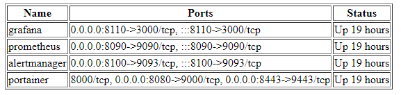

# Docker container exposer

Expose Name\Port\Status as html page apt http port.

## Run

> By default run on port `8000` and listen all (0.0.0.0) address.
```bash
./expose
```

> Run with config

```bash
./expose -config <path/to/config/>

## Config

> Port
- Default: 8000

> Listen Address
- Default: 0.0.0.0

